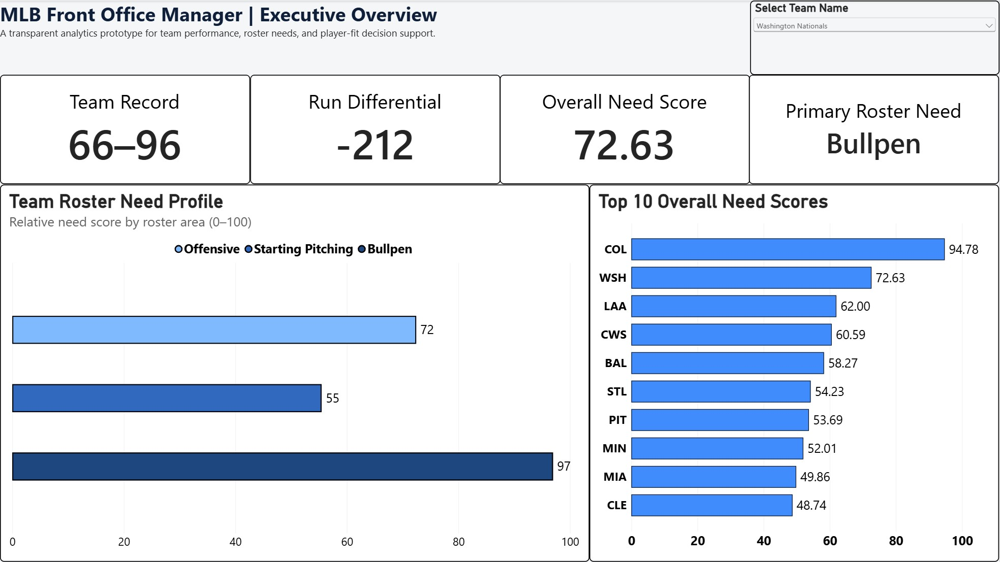
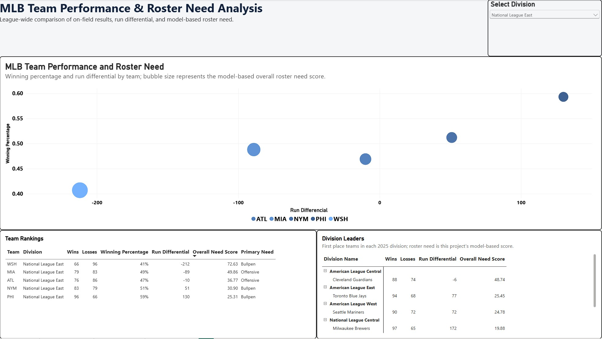
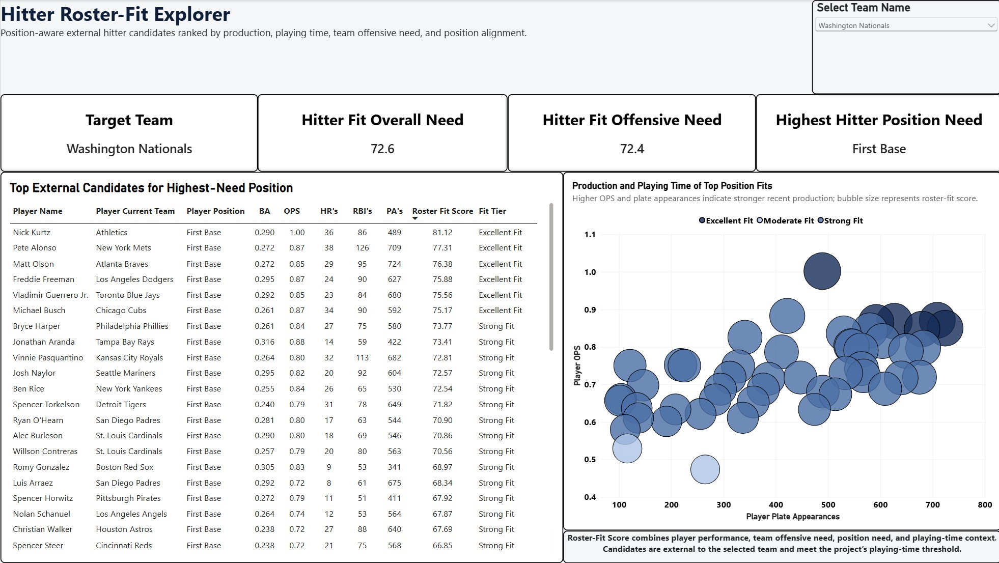
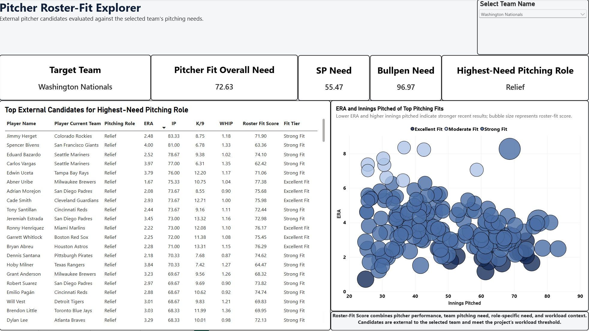

# MLB Front Office Manager

A baseball analytics and business intelligence portfolio project that uses public MLB data to explore team performance, roster needs, and potential player fits.

The project transforms baseball data into analytical tables, applies explainable roster-fit scoring, and presents the results in a four-page Power BI report.

> This is an independent educational portfolio project. It is not affiliated with, endorsed by, or connected to Major League Baseball or any MLB club. Candidate rankings are analytical examples, not transaction recommendations.

## The Business Question

How can a front office move from identifying a team's roster needs to exploring external players who might address them?

The report follows that workflow: assess the selected team, compare it with the league, then examine hitter and pitcher candidates aligned with its needs.

## Power BI Report

| Page | What it answers |
|---|---|
| Executive Overview | What are the selected team's overall roster needs and priorities? |
| Team Performance | How do teams compare on winning percentage, run differential, and modeled roster need? |
| Hitter Roster-Fit Explorer | Which external hitters align with the selected team's highest-need hitting position? |
| Pitcher Roster-Fit Explorer | Which external pitchers align with the selected team's higher-need pitching role? |

The hitter and pitcher explorers include team selectors, need indicators, ranked candidate tables, and scatter charts that put player performance and workload in context.

## Dashboard Screenshots

### Executive Overview



### Team Performance



### Hitter Roster-Fit Explorer



### Pitcher Roster-Fit Explorer



## Methodology

Roster-fit scores are intended to make candidate comparisons transparent and repeatable. The report considers player performance alongside the selected team's needs and the player's position or pitching role.

See [`roster_fit_methodology.md`](Docs/roster_fit_methodology.md) for the scoring definitions, eligibility criteria, assumptions, and limitations. The methodology document and scoring code—not this summary—should be the source of truth for exact weights and thresholds.

## Technology Stack

- Python, pandas, and requests for data extraction and preparation
- SQL for analytical modeling and queries
- Power BI Desktop and DAX for the interactive report
- GitHub and GitHub Desktop for documentation and version control

## Open the Power BI Project

The repository includes a Power BI Project (`.pbip`) file and its accompanying `.Report` and `.SemanticModel` folders. Keep these items together when opening the project in Power BI Desktop.

A local `.pbix` backup is not included in the repository.

## Repository Structure

```text
data/       Datasets included in the repository
docs/       Project documentation
python/     Extraction, transformation, scoring, and validation code
sql/        SQL models and analysis
powerbi/    Power BI documentation, if applicable
tests/      Validation tests, if applicable
assets/
  screenshots/   Images of the four report pages

MLB Front Office Manager Project.pbip
MLB Front Office Manager Project.Report/
MLB Front Office Manager Project.SemanticModel/
roster_fit_methodology.md
README.md
```

## Project Status

**Current phase:** Four-page Power BI report completed; final repository documentation and validation in progress.

## Limitations 

- The analysis uses the data and season represented in the project; it is not a live roster or transaction feed.
- Roster-fit scores are decision-support indicators, not predictions of a player's future performance.
- A high score does not account for every real-world acquisition consideration.

## Author

Michael A. Whitney Jr.  
Data Analyst | Business Intelligence | SQL, Python, & Power BI Development